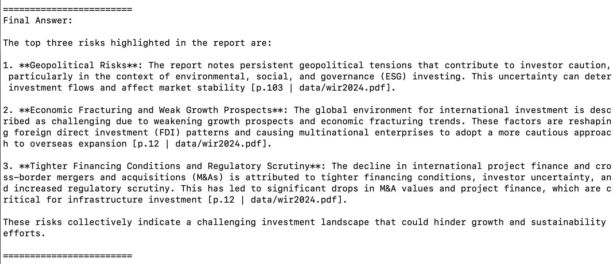
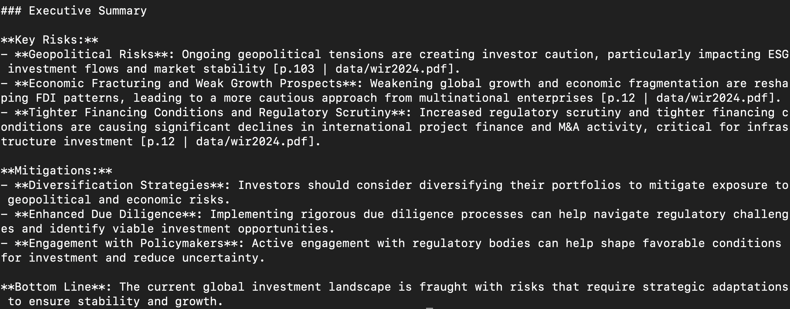

# Business Risk Auditor Multi-Agent System 

<p align="center">
  
</p>

This project is a **multi-agent AI pipeline** that ingests investment reports (PDFs) and extracts **key risks** with context-aware explanations.  
It combines **retrieval**, **analysis**, and **LLM-based synthesis** to produce actionable insights for business users.

---

## Features 

* **PDF Ingestion & Indexing** — FAISS vector store built from PDFs (via `scripts/build_index.py`) using OpenAI or local sentence-transformer embeddings.
* **Retriever Agent** — similarity (or MMR) search, configurable `k` (currently 10).
* **Analyst Agent** — concise, evidence-grounded answers (modern LangChain chain; deprecation-free).
* **Synthesiser Agent** — converts analyst output into an **executive summary** (bullets, mitigations, bottom line).
* **Citations Included** — page + source surfaced in outputs for traceability.
* **Modular Agents** — clean separation; easy to add Evaluator/Coordinator later.

---

## Demo Output

**Query:**  
> What are the top three risks highlighted in the report?

**Answer:**  
1. **Geopolitical Risks**: Persistent tensions causing investor caution, particularly in ESG contexts.  
2. **Economic Fracturing & Weak Growth**: Reshaping global FDI patterns; weaker growth prospects.  
3. **Tighter Financing & Regulatory Scrutiny**: Decline in project finance and cross-border M&As due to tighter conditions and more oversight.  




_Citations: data/wir2024.pdf, pages 12 and 103._

---

## Quickstart

### 1. Clone the repo
```bash
git clone https://github.com/YOUR_USERNAME/risk-auditor-multi-agent.git
cd risk-auditor-multi-agent
````

### 2. Create virtual environment

```bash
python3 -m venv venv
source venv/bin/activate   # macOS/Linux
venv\Scripts\activate      # Windows
```

### 3. Install dependencies

```bash
pip install -r requirements.txt
```

### 4. Build the index

```bash
python scripts/build_index.py --src data/wir2024.pdf --out vectorstore_index
```

### 5. Run the pipeline

```bash
python main.py
# Enter your query when prompted
```

---

## Roadmap
**Streamlit UI** for non-technical users
**Multi-Document Support** for multiple reports
**Automated Evaluation Metrics** (e.g., relevance, completeness)
**Integration with RAG pipelines** for real-time data sources

---

## License

MIT License

```text
MIT License

Copyright (c) 2025 Natasha Smith

Permission is hereby granted, free of charge, to any person obtaining a copy...
```

---

## Credits

Built by [@drnsmith](https://github.com/drnsmith) as part of a production-grade GenAI portfolio.

```

> **Note:** This repository was cleaned and reset on *2025-09-09* to provide a clear, review-ready version of the project.


